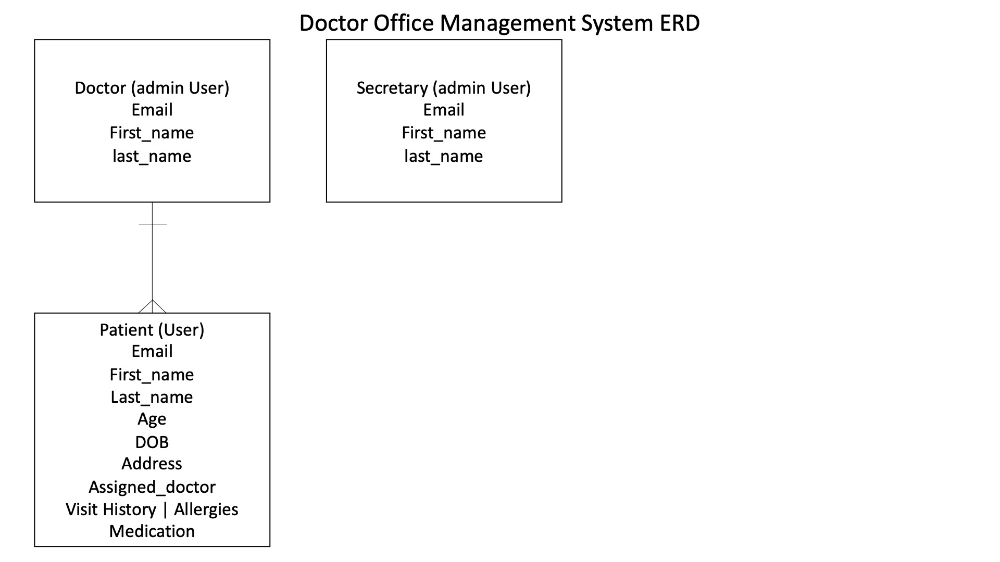

# Doc Manager API

## Background
Doc Manager was built to provide doctor's offices an easy to use application to manage regular tasks at a medical office. You can create new patient records, add doctors, and schedule appointments through google calendar API calls all with an easy to use interface.

## Production Application
Front-End Site: (Link [here](https://oscar-valen115.github.io/doc_manager-client/))  
Front-End Repo: https://github.com/oscar-valen115/doc_manager-client  

Back-End Live API: https://doc-manager-api.herokuapp.com/  
Back-End Repo: https://github.com/oscar-valen115/doc_manager-api

## Technologies Used
- Python
- Django
- Django REST Framework
- Django-cors-headers
- Psycopg2
- Postgresql
- Pytz
- Gunicorn
- [Google Calendar API](https://developers.google.com/calendar)
- [Heroku](https://www.heroku.com)

## Entity Relationship Diagram  

